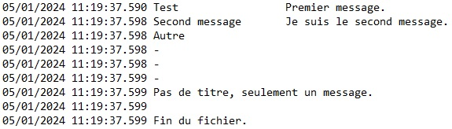

# CSharp_logs

--- 

Générer un fichier de journalisation (*log*) et y écrire des enregistrements à date. Données non structurées.

---

Les fichiers sont créés au chemin de son choix (ici dans un dossier à la racine de l'application).

Capture d'écran du résultat dans le bloc-notes Windows :

Deux configurations possibles :
- passer le chemin du dossier de sortie dans le constructeur de la classe `Logs`,
- **ou bien** utiliser la classe `LogsParametres` pour renseigner les propriétés individuellement.

Paramètres de configuration :
- chemin du dossier où écrire les fichiers,
- préfixe des fichiers,
- format des dates à l'intérieur des fichiers,
- titre de chaque enregistrement jusqu'à un maximum de 30 caractères. On peut définir à 0 pour ne pas avoir d'espace réservé au titre.

La classe `Logs` propose une configuration par défaut :
- préfixe de fichier : aucun,
- format de date dans les fichiers : `yyyy-MM-dd HH:mm:ss.fff`,
- nombre de caractères du titre : 15.

Deux méthodes sont proposées pour écrire une entrée dans le journal :
- `Log(string titre, string message)` : écrire le titre suivi du message,
- `Log(string message)` : écrire le message sans titre et sans l'espace réservé pour ce dernier.

Voir `Program.cs` pour un exemple d'usage.

---

**Évolutions**
- niveau (avertissement, information, erreur, critique...)
- la classe, la méthode appelante, ayant inscrit le *log*,
- le nom ou le numéro du *thread*.

